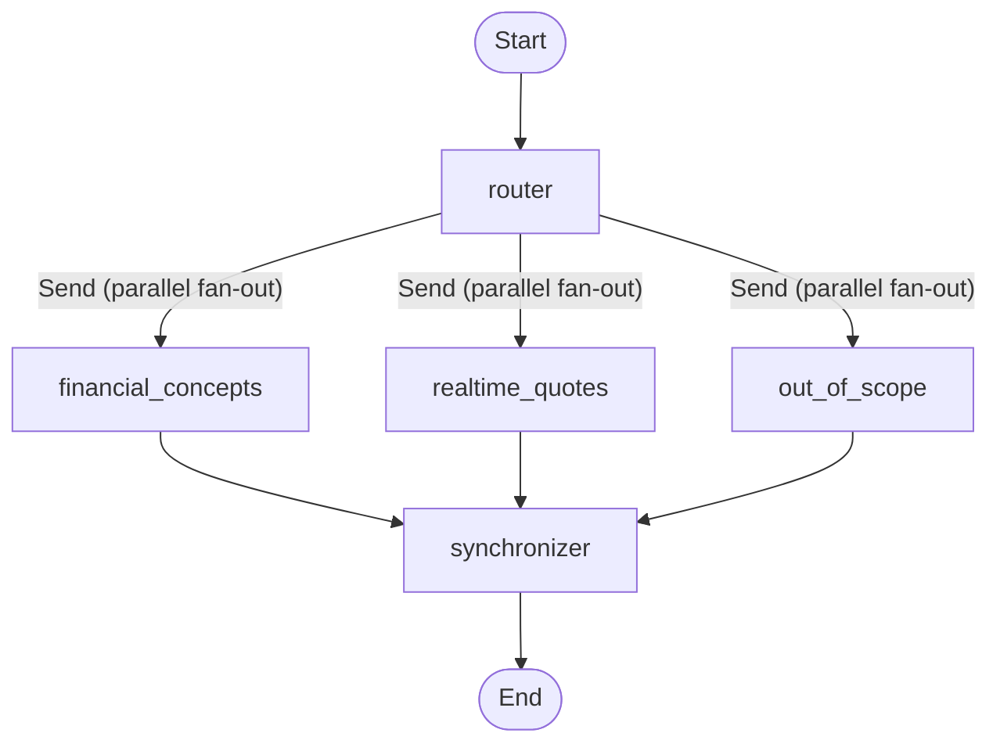

# AI Finance Assistant

A LangGraph-orchestrated assistant that answers financial-concept questions
using Retrieval-Augmented Generation (RAG) over investor-education sources
and fetches real-time stock quotes. Requests outside that scope (anything
that isn't a financial concept or a stock quote) are politely refused. The
assistant is exposed as an interactive terminal REPL, a FastAPI service, and
a Streamlit chat UI, and ships with unit/integration test suites and a
LangSmith-backed evaluation harness.

## Table of Contents

- [Installation](#installation)
- [Usage](#usage)
  - [Run from a terminal](#run-from-a-terminal)
  - [Run with the Streamlit UI](#run-with-the-streamlit-ui)
  - [Run unit tests](#run-unit-tests)
  - [Run integration tests](#run-integration-tests)
  - [Run evaluations](#run-evaluations)
  - [Run the RAG pipeline](#run-the-rag-pipeline)
- [Architecture](#architecture)
- [Command-Line Utilities](#command-line-utilities)
  - [`src/rag/pipeline/rag_pipeline.py`](#srcragpipelinerag_pipelinepy)
  - [`run_workflow.py`](#run_workflowpy)
  - [`evals/runner.py`](#evalsrunnerpy)

## Installation

```bash
# Clone the repository
git clone https://github.com/stevetanasse/ai-finance-assistant.git
cd ai-finance-assistant

# Install dependencies into a managed virtual environment (.venv)
uv sync

# Copy and populate environment variables
cp .env.example .env
```

`.env` requires the following keys:

| Variable | Purpose |
|---|---|
| `OPENAI_API_KEY` | LLM provider key used by the API service and evaluation runner. |
| `LANGSMITH_API_KEY` | Tracing and evaluation experiments. |
| `LANGSMITH_PROJECT` | LangSmith project name (defaults to `ai-finance-assistant`). |
| `LANGSMITH_TRACING` | Set to `true` to enable tracing. |

Before the assistant can answer financial-concept questions, a Qdrant
collection must be populated — see [Run the RAG pipeline](#run-the-rag-pipeline).

```bash
# run the rag pipeline to populate the Qdrant collection
uv run python -m src.rag.pipeline.rag_pipeline --cache-path ./rag_caches --action embed --url-path "rag_sources.txt" --chunk-size 2000 --chunk-overlap 200 --dense-embed bge-small-en-v1.5 --sparse-embed bm42 --verbose
```

## Usage

### Run from a terminal

`run_workflow.py` is an interactive REPL that talks to the compiled
LangGraph application directly, without starting the API or UI:

```bash
uv run python run_workflow.py
```

Type a question at the prompt, read the response, repeat. All turns share a
single thread ID for the life of the process, so conversational context is
preserved until you type `quit` to exit.

### Run with the Streamlit UI

The UI is a thin client over a FastAPI backend, so two processes are needed.

**Terminal 1 — start the API service:**
```bash
uv run uvicorn api.service:app --host 0.0.0.0 --port 8000
```

**Terminal 2 — start the Streamlit UI:**
```bash
uv run streamlit run ui/app.py
```

Then open http://localhost:8501 in your browser.

### Run unit tests

```bash
uv run pytest tests/ -v --cov=src
```

Tests marked `integration` are excluded by default (see `addopts` in
`pyproject.toml`), so this only runs fast, network-free unit tests.

### Run integration tests

Integration tests make real network calls (e.g. embedding and Qdrant
round-trips) and are excluded from the default test run:

```bash
uv run pytest tests/ -v -m integration
```

### Run evaluations

`evals/runner.py` scores the golden dataset (`evals/evaluation_dataset.json`)
against the compiled graph as a LangSmith Experiment:

```bash
uv run python evals/runner.py --experiment-prefix finance-assistant --collection fin_c500_o50_bge-small_bm42
```

Requires `OPENAI_API_KEY`, `LANGSMITH_API_KEY`, `LANGSMITH_PROJECT`, and
`LANGSMITH_TRACING` to be set. See [evals/README.md](evals/README.md) for the
dataset schema and metric definitions.

### Run the RAG pipeline

The Qdrant collection must be populated before the assistant can answer
financial-concept questions. `rag_pipeline.py` runs the offline
download/scrape/chunk/embed pipeline:

```bash
uv run python -m src.rag.pipeline.rag_pipeline \
  --cache-path rag_caches \
  --action embed \
  --url-path urls.txt \
  --chunk-size 2000 \
  --chunk-overlap 200 \
  --dense-embed bge-small-en-v1.5 \
  --sparse-embed bm42
```

See [`src/rag/pipeline/rag_pipeline.py`](#srcragpipelinerag_pipelinepy) below
for the full argument reference.

To target a non-default collection at runtime, set `COLLECTION_NAME`:
```bash
COLLECTION_NAME=fin_c250_o25_bge-small_bm42 uv run uvicorn api.service:app --port 8000
```

## Architecture

The assistant is a LangGraph graph with a router that fans out to one or
more specialist nodes in parallel, then a synchronizer that merges their
output into a single response.



| Node | Description |
|---|---|
| `router` | Entry point. An LLM classifies the request into one or more routes — `financial_concepts`, `realtime_quotes`, `out_of_scope` — and produces a per-route sub-query as structured output (`RouteDecision`). |
| *(fan-out)* | `route_after_router` issues one `Send` per route chosen by the router, so multiple branches (e.g. a financial concept question combined with a stock quote request) run in parallel within the same turn. |
| `financial_concepts` | Runs hybrid (dense + sparse) retrieval against the Qdrant collection and has an LLM synthesize an answer from the retrieved chunks, citing sources. |
| `realtime_quotes` | Has an LLM extract ticker symbols from the query and calls a `yfinance`-backed tool to fetch current prices for up to 3 tickers. |
| `out_of_scope` | Returns a fixed refusal message for requests outside financial concepts and stock quotes. No LLM call. |
| `synchronizer` | Fan-in node. Merges whichever branches ran into one response, in a fixed section order (Out of Scope, then Financial Concept, then Market Data), or passes a single branch's output through unchanged. |

Conversation state is checkpointed in memory (`MemorySaver`), keyed by
thread ID, so multi-turn context is preserved within a process.

## Command-Line Utilities

### `src/rag/pipeline/rag_pipeline.py`

Orchestrates the offline RAG pipeline: downloading source URLs, scraping
them to plain text, chunking the text, and embedding the chunks into a
Qdrant collection. Each `--action` runs that stage and every stage before
it, reusing cached results from prior runs unless `--force-refresh` is set.

```bash
uv run python -m src.rag.pipeline.rag_pipeline \
  --cache-path rag_caches \
  --action embed \
  --url-path urls.txt \
  --chunk-size 500 \
  --chunk-overlap 50 \
  --dense-embed bge-small-en-v1.5 \
  --sparse-embed bm42
```

| Argument | Required | Description |
|---|---|---|
| `--cache-path` | Yes | Parent folder that will contain the pipeline's cache (downloaded HTML, scraped text, chunks, and Qdrant storage). |
| `--action` | Yes | Pipeline stage to run: `download`, `scrape`, `chunk`, or `embed`. Each stage implies all prior stages (e.g. `embed` also downloads, scrapes, and chunks). |
| `--url-path` | Yes | A single URL, or a path to a text file with one URL per line (blank lines and lines starting with `#` are ignored). |
| `--chunk-size` | Only for `chunk`/`embed` | Number of characters per chunk. |
| `--chunk-overlap` | Only for `chunk`/`embed` | Number of overlapping characters between consecutive chunks. Must be less than `--chunk-size`. |
| `--dense-embed` | Only for `embed` | Dense embedding model name. Valid values: `bge-small`, `bge-small-en-v1.5`. |
| `--sparse-embed` | Only for `embed` | Sparse embedding model name. Valid values: `bm42`. |
| `--force-refresh` | No | Re-download and re-scrape URLs even if already cached (default: off). |
| `--verbose` | No | Print per-URL progress and the resolved Qdrant collection name to stdout (default: off). |

Exits with code `0` on success and `1` on any failure (missing/invalid
arguments, a URL file that doesn't exist or is empty, or an unhandled error
during processing).

### `run_workflow.py`

Interactive command-line REPL for the LangGraph application — type a
question, get a response, repeat. Useful for manually exercising the graph
without starting the FastAPI/Streamlit stack. All turns share a single
fixed thread ID for the life of the process, so conversational context is
preserved until you exit.

```bash
uv run python run_workflow.py --collection fin_c500_o50_bge-small_bm42
```

| Argument | Required | Description |
|---|---|---|
| `--collection` | No | Qdrant collection name to query. Defaults to the name derived from `config.yaml` when omitted. |

Type `quit` at the prompt to exit. After each response, the assistant also
prints the running `call_counts` dict (how many times each graph node has
executed so far).

### `evals/runner.py`

Runs the golden evaluation dataset (`evals/evaluation_dataset.json`)
against the compiled LangGraph application as a LangSmith Experiment,
scoring each example with three evaluators (`answer_correctness`,
`refusal_correctness`, `citation_presence`) and printing a summary of
per-metric averages and any zero-score failures.

```bash
uv run python evals/runner.py --experiment-prefix finance-assistant --collection fin_c500_o50_bge-small_bm42
```

| Argument | Required | Description |
|---|---|---|
| `--experiment-prefix` | No | Prefix for the LangSmith Experiment name (default: `finance-assistant`). |
| `--collection` | No | Qdrant collection name to query. Defaults to the name derived from `config.yaml` when omitted. |

Requires `OPENAI_API_KEY`, `LANGSMITH_API_KEY`, `LANGSMITH_PROJECT`, and
`LANGSMITH_TRACING` to be set (e.g. via `.env`); exits early with an error if
any are missing. See [evals/README.md](evals/README.md) for the dataset
schema and metric definitions.
